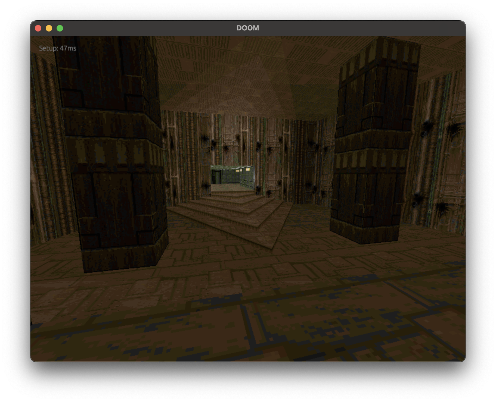

# iron-doom

> README & build instructions work in progress.



Iron DOOM is a DOOM wad renderer/viewer written using WGPU, notably: **with no code from the original DOOM project.**

All wad specifications have been implemented either via:

- The Unofficial DOOM Specs
- Doom Wiki
- ZDoom Wiki
- BOOM reference

I've tested this with:
- DOOM / DOOM2
- FreeDOOM
- Heretic
- Chex Quest

## Running the code

The last Rust nightly is required:

```sh
rustup default nightly
rustup upgrade nightly
```

Then, run `cargo run --release` from the `id_viewer` project.

Soon this will be accessible via a Web interface.

## TODO

Code quality / bugs:
- [X] Finish ECS conversion
- [ ] Make ECS for walls/sectors "real time."
- [ ] Add support for mipmaps
- [ ] Fix sky shader

Feature enhancements:
- [ ] Add things (entities)
- [ ] Add animated textures